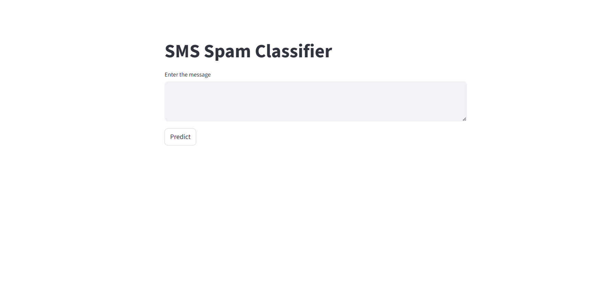

# Spam_detector
📨 SMS Spam Detector using Machine Learning

A simple and interactive Streamlit web app that classifies messages as Spam or Not Spam using Natural Language Processing (NLP) and a Machine Learning model.

🚀 Features

🧠 Uses TF-IDF Vectorizer and a trained ML model (e.g., Naive Bayes)

🔤 Cleans and preprocesses text using NLTK (tokenization, stopword removal, stemming)

⚡ Real-time prediction in a web interface powered by Streamlit

🧩 Lightweight, fast, and easy to deploy

🏗️ Project Structure
Spam_detector/
│
├── app.py                # Main Streamlit app
├── model.pkl             # Trained ML model (pickle file)
├── vectorizer.pkl        # TF-IDF vectorizer
├── requirements.txt      # Dependencies
├── .gitignore            # Ignored files and folders
└── README.md             # Project documentation

⚙️ Installation & Setup
1. Clone the repository
git clone https://github.com/shubhamgawade944/Spam_detector.git
cd Spam_detector

2. Create a virtual environment (recommended)
python -m venv venv
venv\Scripts\activate     # For Windows
# OR
source venv/bin/activate  # For Mac/Linux

3. Install dependencies
pip install -r requirements.txt

4. Run the app
streamlit run app.py

🧠 Model Details

Vectorizer: TF-IDF (vectorizer.pkl)

Model: Multinomial Naive Bayes (model.pkl)

Training Data: SMS Spam Collection Dataset

Libraries Used:

scikit-learn
nltk
streamlit
pandas

📋 Example Inputs
Example Message	Prediction
“Congratulations! You’ve won a $500 gift card.”	Spam
“Hey, are we still meeting tomorrow?”	Not Spam
🧰 Requirements

All dependencies are listed in requirements.txt.
Install them via:

pip install -r requirements.txt
📦 Deployment
You can easily deploy this project using:
Streamlit Cloud
Render
Heroku

🧑‍💻 Author

Shubham Gawade
📧 shubhamgawade132003@gmail.com

🌐 GitHub Profile

